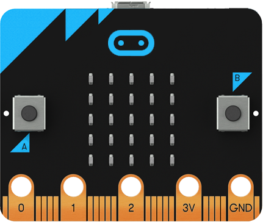

# micro : bit(マイクロビット)とは？

イギリス生まれのシングルボードコンピュータで、従来のマイコンボードのようにコードを書いてプログラムするのではなく、LEGOのようにブロックをつなぎ合わせて命令を行うのが特徴。また、専用のソフトをPCにインストールせずとも、公式ウェブサイト上でプログラミングが行える\(WiFi環境下であればOK\)。

小さいボディに、ボタン、光 • 温度 • 動きセンサーに加え無線通信モジュールを備えており、プロトタイピングに十分な機能を扱うことができます。
