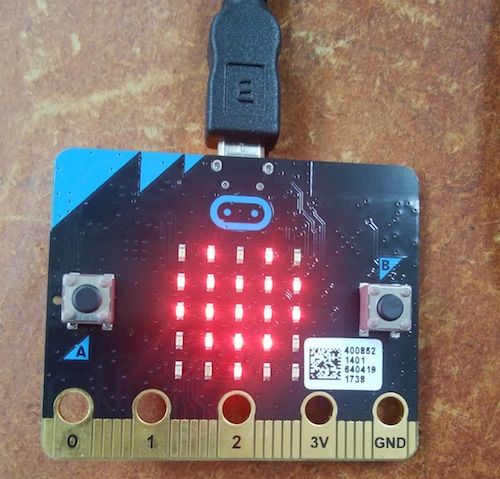

# 02:　micro : bit基礎

まずは、micro:bitにLチカ\(LEDチカチカの略、電子工作では初めて使う環境ではまずLEDをコントロールして使用感を確かめるのがとなっている\)プログラムを書き込んでみる！

まずは、[**micro:bitのブロックエディター**](https://makecode.microbit.org/#)を開く

まずは、画面右側のブロックを以下の様に組み合わせる↓

ここまで、ブロックを組むと画面左側で実際このプログラムでmicro:bitがどういう動きをするかシミュレーションが始まる。

動作を確認したら、どういうファイル名でコードをダウンロードするか半角英数字で入力する↓  
\(ここでは、"**l-chika**"という名前にした\)  

ファイル名を入力したら、早速"**ダウンロード**"ボタンを押して.hexファイルをダウンロードする！  

.hexファイルのダウンロードが終わると、以下のメッセージが出る。  
実際のファイル名は"microbit-l-chika.hex"として保存されたことが分かる。

micro:bitをUSBケーブルでPCと接続し、USBメモリのようにMICROBITという名前のフォルダが表示されるので、

そこに先程の.hexファイルをドラッグ&ドロップする。

ファイル転送が終わると自動的にMICROBITの接続が解除される。

この時、macだと以下のようなエラーメッセージが出るが特に問題ないので無視

正常に.hexファイルがmicro:bitに書き込まれると、実際にボードのLEDが点滅を始める

**おめでとう！初プログラムが動き出した！  
でも、実際には何がおこってるのか？**

実は、ブロックの左上の**？マーク**をクリックすると、

そのブロックがどういう働きをしているのか見ることができる

各ブロックがどういう機能を持ち、どういった順番で実行されるのかを理解できれば、より快適にプログラミングできるようになってくる。
